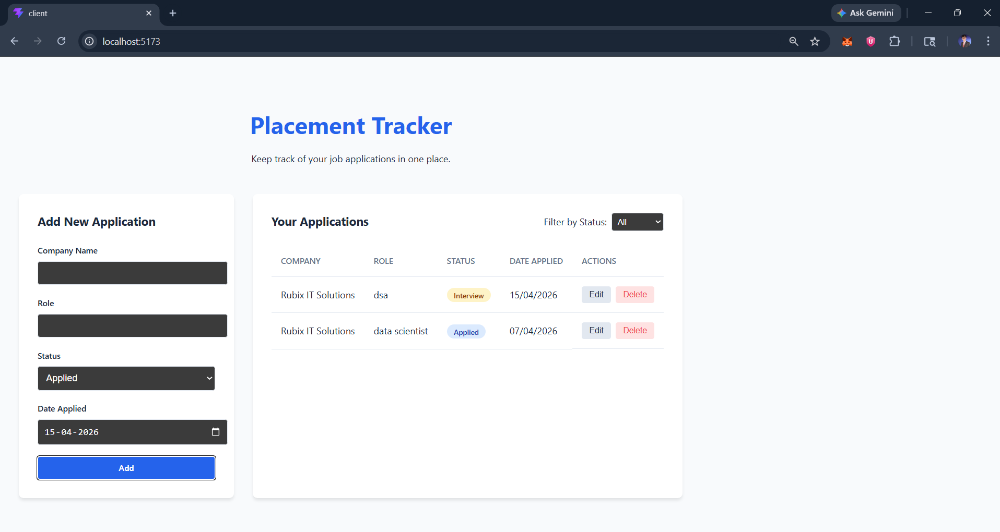

# Placement Tracker

A full-stack MERN (MongoDB, Express, React, Node.js) application to track job and internship applications.

## 📸 Screenshot



## Features
- **Add Applications**: Log your company applications with role and status.
- **View All**: See all your applications in a clean table format.
- **Update Status**: Easily update the status of your applications.
- **Delete**: Remove old or irrelevant applications.
- **Filter**: Filter applications by status (Applied, Interview, Selected, Rejected).
- **Responsive UI**: Clean and responsive design built with React and custom CSS.
- **Loading States**: Visual feedback with a loading spinner during API calls.

## Tech Stack
- **Frontend**: React (Vite), Axios, Hooks (useState, useEffect)
- **Backend**: Node.js, Express
- **Database**: MongoDB (Mongoose)
- **Config**: Dotenv for environment variables
- **CORS**: Enabled for frontend-backend communication

## Folder Structure
```
placement-tracker/
ΓööΓöÇ client/       # React (Vite) frontend
ΓööΓöÇ server/       # Node.js/Express backend
```

## Setup Instructions

### 1. Clone the repository
```bash
git clone <your-repo-url>
cd placement-tracker
```

### 2. Backend Setup
```bash
cd server
npm install
```
Create a `.env` file in the `server` directory:
```env
PORT=5000
MONGODB_URI=your_mongodb_connection_string
```
Start the backend:
```bash
npm run dev
```

### 3. Frontend Setup
```bash
cd client
npm install
```
Create a `.env` file in the `client` directory:
```env
VITE_API_URL=http://localhost:5000/applications
```
Start the frontend:
```bash
npm run dev
```

## Deployment Steps

### Backend (Render)
1. Push your code to a GitHub repository.
2. Create a new "Web Service" on [Render](https://render.com/).
3. Connect your repository.
4. Set the **Root Directory** to `server`.
5. Set **Build Command** to `npm install`.
6. Set **Start Command** to `npm start`.
7. Add **Environment Variables**:
   - `MONGODB_URI`: Your MongoDB Atlas connection string.
   - `PORT`: 10000 (Render's default).

### Frontend (Vercel)
1. Create a new project on [Vercel](https://vercel.com/).
2. Connect your repository.
3. Set the **Root Directory** to `client`.
4. Set **Framework Preset** to `Vite`.
5. Add **Environment Variables**:
   - `VITE_API_URL`: The URL of your deployed backend (e.g., `https://your-backend.onrender.com/applications`).
6. Deploy!

## API Endpoints
- `GET /applications`: Fetch all applications.
- `POST /applications`: Create a new application.
- `PUT /applications/:id`: Update an application status.
- `DELETE /applications/:id`: Delete an application.

---
Created as a Placement Tracker Project.
